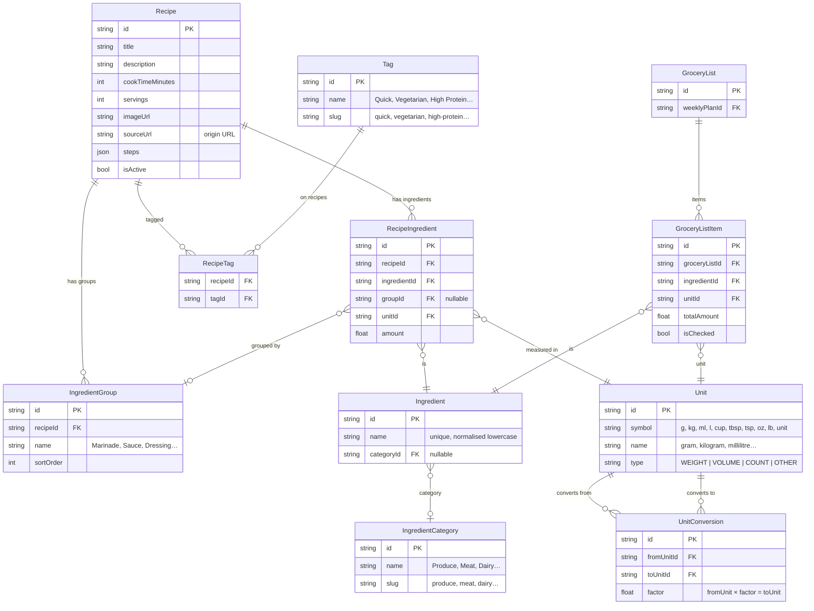

# Proposed Mealy Schema — ER Diagram

```mermaid
erDiagram
    Recipe {
        string id PK
        string title
        string description
        int cookTimeMinutes
        int servings
        string imageUrl
        string sourceUrl "origin URL"
        json steps
        bool isActive
    }

    IngredientGroup {
        string id PK
        string recipeId FK
        string name "Marinade, Sauce, Dressing…"
        int sortOrder
    }

    RecipeIngredient {
        string id PK
        string recipeId FK
        string ingredientId FK
        string groupId FK "nullable"
        string unitId FK
        float amount
    }

    Ingredient {
        string id PK
        string name "unique, normalised lowercase"
        string categoryId FK "nullable"
    }

    IngredientCategory {
        string id PK
        string name "Produce, Meat, Dairy…"
        string slug "produce, meat, dairy…"
    }

    Unit {
        string id PK
        string symbol "g, kg, ml, l, cup, tbsp, tsp, oz, lb, unit"
        string name "gram, kilogram, millilitre…"
        string type "WEIGHT | VOLUME | COUNT | OTHER"
    }

    UnitConversion {
        string id PK
        string fromUnitId FK
        string toUnitId FK
        float factor "fromUnit × factor = toUnit"
    }

    Tag {
        string id PK
        string name "Quick, Vegetarian, High Protein…"
        string slug "quick, vegetarian, high-protein…"
    }

    RecipeTag {
        string recipeId FK
        string tagId FK
    }

    GroceryList {
        string id PK
        string weeklyPlanId FK
    }

    GroceryListItem {
        string id PK
        string groceryListId FK
        string ingredientId FK
        string unitId FK
        float totalAmount
        bool isChecked
    }

    Recipe ||--o{ IngredientGroup   : "has groups"
    Recipe ||--o{ RecipeIngredient  : "has ingredients"
    Recipe ||--o{ RecipeTag         : "tagged"
    RecipeIngredient }o--|| Ingredient       : "is"
    RecipeIngredient }o--|| Unit             : "measured in"
    RecipeIngredient }o--o| IngredientGroup  : "grouped by"
    Ingredient       }o--o| IngredientCategory : "category"
    Unit             ||--o{ UnitConversion   : "converts from"
    Unit             ||--o{ UnitConversion   : "converts to"
    Tag              ||--o{ RecipeTag        : "on recipes"
    GroceryList      ||--o{ GroceryListItem  : "items"
    GroceryListItem  }o--|| Ingredient       : "is"
    GroceryListItem  }o--|| Unit             : "unit"
```
